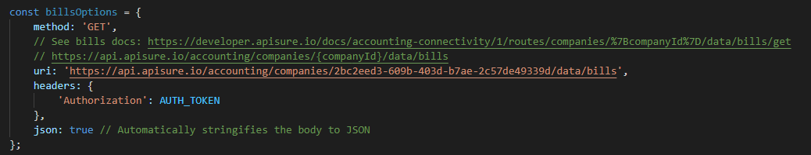

# Surecomp's Accounting Connectivity Sample

This repository contains a quick setup sample for using Surecomp's Accounting Connectivity API.<br/>
For the complete docs click [here](https://developer.apisure.io/docs/accounting-connectivity/1/overview)

## Quick Start:
 - Install dependencies: ```npm i```
 - Set auth token within connect.js file: ```const AUTH_TOKEN = 'Basic YOUR TOKEN HERE';```
 - Run: ```node connect.js```

## Retrieving bills:
Set the relevant company id parameter in connect.js:

